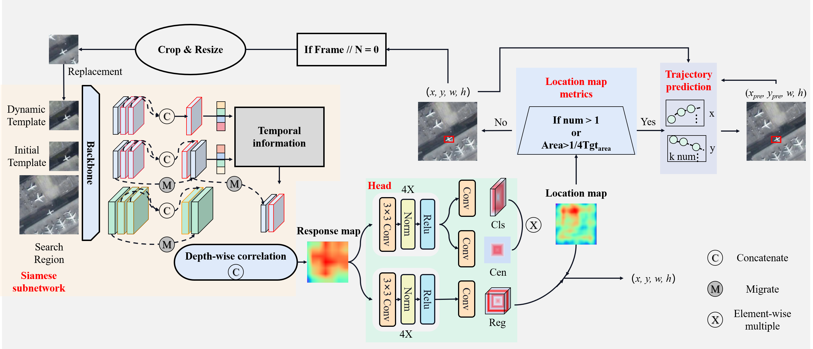

# SiamTITP
SiamTITP: Incorporating temporal information and Trajectory prediction Siamese Network for Satellite Video Object Tracking.
The overall framework of SiamTITP:


## 1. Environment
This code has been tested on Ubuntu 22.04, Python 3.8, Pytorch 1.10.0, CUDA 11.1. Please install related libraries before running this code:
> install necessary packages
```python 
pip install -r requirements.txt
```
## 2. Performance 
<table>
  <!-- 表头 -->
  <tr>
    <th colspan="2">Dataset</th>
    <th>SatSOT</th>
    <th>SV248S</th>
    <th>OOTB</th>
    <th>Speed</th>
  </tr>
  
  <!-- 原始行 -->
  <tr>
    <td rowspan="2">SiamTITP</td>
    <td>Success（%）</td>
    <td>51.3</td>
    <td>54.4</td>
    <td>63.7</td>
    <td rowspan="2">33.85</td>
  </tr>
  
  <!-- 拆分行后的第二行 -->
  <tr>
    <!-- 注意：此处首列已被 rowspan 占用，无需重复 -->
    <td>Prcision（%）</td>
    <td>72.2</td>
    <td>88.1</td>
    <td>88.6</td>
    <!-- 注意：此处首列已被 rowspan 占用，无需重复 -->
  </tr>
  
</table>

## 3. Test
The test datasets is avalible in:[SatSOT](http://www.csu.cas.cn/gb/kybm/sjlyzx/gcxx_sjj/sjj_wxxl/202106/t20210607_6080256.html)，[SV248S](https://github.com/xdai-dlgvv/SV248S)，[OOTB](https://github.com/YZCU/OOTB) <br>
Due to lack of offical json files, we create the specifical json files for datasets, please refering to [gen_json.py](toolkit/datasets) files. Meanwhile, we provied the model parameters. These can be download in [Google driver](https://drive.google.com/drive/folders/1Np96H0aRnwrG5vRKskaN17ft0r2ANEgt?usp=sharing) or [Baiduyun](https://pan.baidu.com/s/1_d5FvUG9rsTYutEVFbPRxA), the code is:java. If you want to test the tracker on a new dataset, please refer to pysot-toolkit to set test_dataset.
> test model performance
```python 
python test.py
--dataset  SatSOT                    / # dataset name
--snapshot snapshot/SiamTITP_r50.pth  # tracker_name
```
The tracking reulsts will be saved in the **results/dataset_name/tracker_name** directory.

## 4. Evaluation
We provide the tracking results[Baiduyun](https://pan.baidu.com/s/1_d5FvUG9rsTYutEVFbPRxA), the code is:java;[Google driver](https://drive.google.com/drive/folders/1Np96H0aRnwrG5vRKskaN17ft0r2ANEgt?usp=sharing) of SatSOT, SV248S and OOTB datasets. <br>
If you want to evaluate the tracker, please put those results into results directory.
> evaluate model performance
```python 
python eval.py 	                    \
	--tracker_path ./results          \ # result path
	--dataset SatSOT                  \ # dataset_name
	--tracker_prefix 'r50'   # tracker_name
```
## 5. Acknowledgement
The code is implemented based on pysot and [SiamCAR](https://github.com/ohhhyeahhh/SiamCAR?tab=readme-ov-file#5-acknowledgement). We would like to express our sincere thanks to the contributors.

## 6. Cite
```python 
@ARTICLE{11051136,
  author={Zhou, Jiawei and Dong, Yanni and Du, Bo},
  journal={IEEE Transactions on Image Processing}, 
  title={SiamTITP: Incorporating Temporal Information and Trajectory Prediction Siamese Network for Satellite Video Object Tracking}, 
  year={2025},
  volume={34},
  number={},
  pages={4120-4133},
  keywords={Feature extraction;Trajectory;Satellites;Transformers;Object tracking;Measurement;Target tracking;Kalman filters;Data mining;Training;Siamese network;object tracking;temporal information;trajectory prediction;satellite video},
  doi={10.1109/TIP.2025.3573527}}
```


